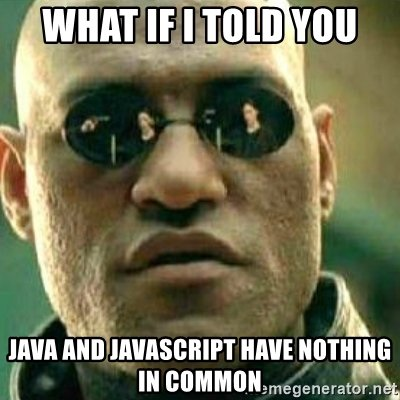

<style>
.slide {
    justify-content: initial!important;
}
.slide p, .slide li { font-size:0.80em; }
.slide li li { font-size:1em; }
.slide h2, .slide h1 { padding-bottom:0.1em; }
.slide pre { font-size:0.8em; }
.slide table { font-size:0.7em; }
.slide .two-pre { 
	flex:2;
    gutter:5px;
	width:100%;
    height:100%;
	display:flex;
	flex-flow: row wrap;
    align-items: stretch;
    justify:center;
}
.slide .two-pre pre {
	flex:1;
    display:block;
    margin:0 5px;
    font-size:0.55em;
}

</style>
# Introduction au Javascript

## Du back-end au front-end, une introduction au JS via Python

Thibault Clérice,
École Nationale des Chartes
https://github.com/ponteineptique/cours-javascript


------

# Objectifs du cours

- Cours 1
  - Comprendre ce qu’est le javascript
  - Le javascript dans le HTML
  - Comment déboguer du javascript
  - Syntaxe du javascript (par rapport à python)
  - Le DOM
- Cours 2
  - L'usage de bibliothèques
  - Le concept d'Ajax
  - Le concept de fonctions anonyme et de *callback*
  - Utilisation d'une librairie
  	- Faire un pop-up à partir de données Ajax
- Cours 3 et suivants
  - Faire une carte avec Leaflet
  - Ajout de champs en HTML
---

# Bibliographie

- Php, MySQL et Javascript, Nixon, O’Reilly
- JavaScript & JQuery, Jon Duckett, Wiley & Sons
- Eloquent Javascript, Haverbeke, O’Reilly (3e édition : http://eloquentjavascript.net/3rd_edition/ )

---

# Bibliographie (2)

- Cours
  - http://fr.eloquentjavascript.net
  - http://www.gchagnon.fr/cours/dhtml/
- Outils
	- https://jsfiddle.net/
	- http://labs.codecademy.com/
- Veille
	- https://reddit.com/r/javascript
	- http://stackoverflow.com
- Nouvelles fonctionnalités ES6
	- https://github.com/addyosmani/es6-equivalents-in-es5
---

# Avertissement

Ce cours n'a pas été écrit en utilisant la syntaxe nouvelle de ES 6 et ES 7, qui sont les dernières versions de javascript. Il est possible que les manuels les plus à jour utilisent cette nouvelle syntaxe, très proche de celle utilisée ici.

---

# Qu'est-ce que javascript ?




1. Javascript est originellement un langage prévu pour l'interaction sur une page web. Il permet d'altérer le code HTML de la page après son envoi par le serveur.
2. Contrairement au serveur, Javascript possède des informations sur l'interface de l'utilisateur : taille de fenêtre, position du curseur, etc.
3. Ses versions sont nommées EcmaScript
4. Il peut être utilisé aussi du côté serveur via NodeJS.
	1. Il a d'ailleurs son petit succès de ce côté là.
5. Il est à la mode de créer des applications en n'utilisant que du Javascript et des APIs (pas de HTML prégénéré)

---

# Courte histoire du javascript


- Création : 1995
- Dernière version ES7@
	- Très proche de ES6
	- Et donc très loin de ES5
	- https://kangax.github.io/compat-table/es6/
	- Mais proche d’ActionScript (Avec 15 ans de retard)
		- Qui lui même est proche d’ES4 (abandonné)

---

# Où se situe le javascript dans le Web ?


---

# Le javascript dans du HTML : en insertion directe

```html
<html>
  <head>
    <script type=”text/javascript”>
      // Le javascript ici
    </script>
  </head>
  <body>
    <script type=”text/javascript”>
      // Le javascript ici
    </script>
  </body>
</html>
```

---

# Le javascript dans du HTML : en insertion externe

```html
<html>
  <head>
    <script type=”text/javascript” 
      src=”./chemin/vers/javascript.js”></script>
  </head>
  <body>
    <script type=”text/javascript” 
      src=”./chemin/vers/javascript.js”></script>
  </body>
</html>
```

---

# Déboguer du javascript

- Firefox
	- Outils > Web Developer > Debugger 
	- Ctrl + Maj + S // Pomme + Maj + S
- Chrome
	- Ctrl + Maj + I // Pomme + Maj + I

---

# Développer du javascript

- IDE : WebStorm (PyCharm de Javascript)
- Éditeur de texte avancé:
  - Sublime
  - Atom
  - Bracket

---

# Syntaxe du javascript (1)

## Général

1. Une ligne se finit par un `;` quand une instruction est finie.
2. Les variables se définissent comme en python :
```js
mon_nombre = 456;
ma_chaine = "Hello !";
```
4. Il est de bonne pratique de précéder la variable par `var` quand on la crée.
3. On commente avec `//` sur une seule ligne ou avec `/*` et `*/` sur plusieurs :
```js
var mon_nombre = 456;  // N'est-ce pas magnifique ?
/* Je peux écrire
un commentaire sur plusieurs lignes
*/
var ma_chaine = "789";
```

---

# Syntaxe du javascript (2)

## Blocs  conditionnels

1. Les blocs `if-elif-else` s'écrivent avec des accolades `{}`. 
2. On entoure les conditions avec des parenthèses `(variable == True)`
3. `and` pour que deux conditions soient valides s'écrit `&&`
4. `or` pour qu'une condition soit valide sur les deux s'écrit `||`

```js
ma_variable = 123;
if (ma_variable == 123) {
	// Que faire ?
} else if (ma_variable == "123") {
	// Que faire ?
} else {
	// Que faire ?
}
```
---

# Syntaxe du javascript (3)

## Égalités

Les égalités s'expriment de la même manière qu'en Python. On fera attention cependant aux variantes `===` et `!==` qui signifient strictement égales ou inégales. On les préfèrera à `==` et `!=`. *Cf.* https://dorey.github.io/JavaScript-Equality-Table/

| Opérateur                   | Exemples qui renvoient true          |
|-----------------------------|--------------------------------------|
| Égalité (==)                | `3 == var1` `"3" == var1` `3 == '3'` |
| Inégalité (!=)              | `var1 != 4`  `var2 != "3"`           |
| Égalité stricte (===)       | `3 === var1`                         |
| Inégalité stricte (!==)     | `var1 !== "3"`  `3 !== '3'`          |
| Supériorité stricte (>)     | `var2 > var1`  `"12" > 2`            |
| Supériorité ou égalité (>=) | `var2 >= var1` `var1 >= 3`           |
| Infériorité stricte (<)     | `var1 < var2`  `"2" < "12"`          |
| Infériorité ou égalité (<=) | `var1 <= var2` `var2 <= 5`           |

---

# Syntaxe du javascript (4)

## Les Chaînes

1. Tout comme en Python, les chaînes se distinguennt des variables grâce aux `"` et aux `		'`.
2. On concatène des chaînes via `+` : `var x = "a" + "b"; "ab" === x;`
3. Les tranches de chaînes s'écrivent avec la méthode `.substring(début, fin)` :
	- `fin` est optionnel et n'est pas inclusif (comme l'index de fin en python)
	- Si `fin` n'est pas spécifié, `.subtring(début)` va jusqu'à la fin

<div class="two-pre">

```javascript
// Javascript
var v = "chanter";

// Sans end
v.substring(3) == "nter";
// Avec une fin
v.substring(0, 3)] === "cha";
// Avec une fin relative
v.substring(0, v.length-2) === "chant";
```

```python
# Python
v = "chanter"

# Sans end
v[3:] == "nter"
# Avec une fin
v[0:3] == "cha"
# Avec une fin relative
v[0:-2] == "chant"
```

</div>

4. On transforme une chaîne en entier via la fonction `parseInt()` : `parseInt("42") === 42` (*en python, `int("42")`*)
5. On transforme une chaîne en décimal via `parseFloat()`

---

# Syntaxe du javascript (5)

## Les Chaînes (2)

6. On joint les listes via `.join()` où `join` est une méthode de liste
7. On sépare une chaîne via `.split(délimiteur)`
8. On peut tester les préfixes et suffixes via `.startsWith()` et `.endsWith()`

<div class="two-pre">

```javascript
// Javascript
var v = ["1", "2"];
// Jointure: Attention! Inverse de Py. !
v.join(" ") === "1 2"

// Découpage
var n = 'c d  e ';
n.split(' '); // ['c', 'd', '', 'e', '']
// Accepte une expression régulière
n.split(/\s+/); // ['c', 'd', 'e', '']

// Préfixes
n.startsWith("c") === true;
n.endsWith("e") === false;
```

```python
# Python
v = ["1", "2"]
# Jointure
" ".join(v) == "1 2"

# Découpage 
n = 'c d  e '
n.split(' ') == ['c', 'd', '', 'e', '']
# Vide pour tout type d'espace
n.split() == ['c', 'd', 'e']

# Préfixes
n.startswith("c") == True
n.endswith("e") == False
```

</div>

---

# Syntaxe du javascript (6)

## Les Chaînes (3)

9. `.replace(recherche, remplacement)` permet de faire des remplacements de chaînes
	- Fonctionne avec des expressions régulières
	- On peut utiliser les paramètres 
		- `g` (Valable sur toute la chaîne : global) 
		- `i` (Insensible à la casse)
```javascript
// Javascript
var s = 'do re mi mi Mi';
// Avec une chaîne
s.replace("mi", 'ma') === "do re ma mi Mi";
// Avec une expression régulière
s.replace(/mi/, 'ma') === "do re ma mi Mi";
// Avec un paramètre g pour global
// Serait l'équivalent en python de .replace()
s.replace(/mi/g, 'ma') === "do re ma ma Mi";
// Serait l'équivalent en python de .replace()
s.replace(/mi/gi, 'ma') === "do re ma ma ma";

```

---

# Syntaxe du javascript (7)

## Dictionnaires et listes

1. Les dictionnaires et listes sont appelés `Object` et `Array`. 
2.  Les dictionnaires sont en fait des objets (au sens instance de classe avec `self` en python) simplifiés
3. L'écriture d'une liste ou d'un dictionnaire sont similaires :
```js
var dico = {
  "python": "Un langage propre",
  "javascript": "Un langage discuté",
  "php": "Personne ne m'aime",
  "delphi": "?"
}
var liste = ["a", 1, "4", dico]
```
4. L'accès se fait comme en python : `liste[0] === "a"` et `dico["delphi"] === "?"`. Mais on peut ajouter l'écriture `dico.delphi === dico["delphi"]` comme écriture.

---

# Syntaxe du javascript (8)

## Dictionnaires et listes

| Description                  | Python                | Javascript                   |
|------------------------------|-----------------------|------------------------------|
| Assignation                  | `x= [1, 2, 3]`        | `var x = [1, 2, 3]`           |
| Taille                       | `len(x) == 3`         | `x.length === 3`             |
| Vide                         | `not x`               | `x.length === 0`             |
| Element `i`                  | `x[i]`                | `x[i]`                       |
| Dernier élément              | `x[-1] == 3`          | `x[x.length-1] === 3`        |
| Sous-ensemble                | `x[1:2] === [2, 3]`   | `x.slice(1,2) === [2, 3]`    |
| Sous-ensemble jusqu'à la fin | `x[1:] == [2, 3]`     | `x.slice(1) === [2, 3]`      |
| Ajout d'un élément           | `x.append(4)`         | `x.push(4)`                  |
| Tri                          | `x.sort()`            | `x.sort()`                   |
| Inclut                       | `2 in x`              | `x.includes(2)`              |
| Additon de listes            | `[1] + [2] == [1, 2]` | `[1].extend([2]) -> [1, 2]`  |


---

# Syntaxe du javascript (9)

## Les boucles

<div class="two-pre">

```js
// Javascript
var liste = [6, 7, 8];
for (var entier of liste) {
  console.log(entier * 2);
}

// Énumeration basée sur une liste
for (var i = 0; i < liste.length; ++i) {
  console.log(liste[i]);
}

// Énumeration basée sur une range
for (var i = 0; i < 100; ++i) {
  console.log(i);
};

// Pas avec while
var i = 0;
while (i < 100) {
  console.log(i);
  i += 1;
};

// Boucle sur clé de dictionnaire
var dico = {"a": "b", "c": "d"};
for (var cle in dico) {
  print(dico[cle]);
};
```

```python
# PYTHON
liste = [6, 7, 8];
for entier in liste:
  print(entier * 2)


# Énumeration basée sur une liste
for index, entier in enumerate(liste):
  print(entier == liste[index])


# Énumeration basée sur une range
for i in range(0, 100):
  print(i)


# Pas avec while
i = 0;
while i < 100:
  print(i)
  i += 1
  

# Boucle sur clé de dictionnaire
dico = {"a": "b", "c": "d"};
for cle in dico {
  print(dico[cle])
}
```

</div>

---

# Satané Javascript


1. Il n'est pas possible de comparer des listes et des objets entre eux-elles

```javascript
var dico1 = { a: 'b', c: 'd' };
var dico2 = { a: 'b', c: 'd' };
dico1 === dico2 // false
```
2. Une variable qui n'a pas de valeur est `undefined` (En python, une erreur serait lancée)
```javascript
var x = function(z) { console.log(z); };

```
3. Il y a un mode strict en javascript. On le définit comme suit en haut de fichier ou de script :
```javascript
'use strict';
```
*On réfléchira vivement sur le fait que le mode permissif soit celui par défaut.*

---

# Satané Javascript (2)


Python : `[1, 2] == [1, 2]`

Javascript : https://stackoverflow.com/questions/7837456/how-to-compare-arrays-in-javascript

<div style="font-size:0.8em;">

```js
var equals = function (l1, l2) {
  // Si l'autre array n'est pas vraiment rempli
  if (!l1 || !l2) { return false; }

  // Comparaison des tailles
  if (l1.length != l2.length) { return false; }
  for (var i = 0, l=l1.length; i < l; i++) {
    // On vérifie si on a une liste dans une liste
    if (l1[i] instanceof Array && 
           l2[i] instanceof Array) {
      // Si oui, on réutilise la fonction
      if (!equals(l1[i], l2[i]) { return false; }
    } else if (l1[i] != l2[i]) { 
        // Attention, si ce sont des objets,
        // toujours false malheureusement
        return false;   
      }           
    }       
  return true;
}
comp_liste([1, 2, [7, 8]], [1, 2, [7, 8]]);
```
</div>

---

# Satané Javascript (3)


Python : 

```python
def affine(x, a=2, b=5):
  return a*x+b
affine(x, b=7)
```

Javascript :

<div style="font-size:0.8em;;">

```js
var affine = function(x, options) {
  var defauts = {"a": 2, "b": 5};
  if (!options) {
    options = defauts;
  } else {
    for (var cle in defaults) {
      if (!options[cle]) { options[cle] = defaut[cle]; }
    }
  }
  return options["a"] * x + options["b"];
}
affine(2, {"b": 7});
```
</div>


---

# Satané Javascript (4)


Il faut tout de même noter que  de nombreuses librairies permettent de simplifier certaines de ces écritures. jQuery et Underscore en font partie et permettront d'écrire plus rapidement certaines blocs en les important.

Notez que si vous trouvez un jour `vanilla javascript`, cela signifie que c'est du javascript pur sans librairie.

<div class="two-pre">

```js
// Javascript Vanilla
var def = {
  "a": 2,
  "b": 5
};
if (!opt) {
  opt = def;
} else {
  for (var cle in def) {
  if (!opt[cle]) {
    opt[cle] = def[cle];
  }
}
```

```js
// jQuery
var def = {
  "a": 2,
  "b": 5
};
$.extend(true, opt, def);
```

```js
// Underscore.js
var def = {
  "a": 2,
  "b": 5
};
opt = _.extend(opt, def);
```

</div>

---

# Fonctions

<div class="two-pre">

```js
/**
 * Conjugue un verbe du 1er groupe
 *   au présent
 *
 * @param {str} v Verbe à l'infinitif
 * @param {int} p Personne
 * @param {int} n Nombre 
      (1 si singulier, autre si pluriel)
 * @return {str} Verbe conjugué
 */
var conjugue = function(v, p, n) {
 var verbe = v.substring(0, v.length-2);
 if (n === 1) {
   if (p === 1) {
     return verbe + "e";
   } else if (p === 2) {
     return verbe + "es";
   } else if (p === 3) {
     return verbe + "e";
   }
 } else {
   if (p === 1) {
     return verbe + "ons";
   } else if (p === 2) {
     return verbe + "ez";
   } else if (p === 3) {
     return verbe + "ent";
   }
 }
}

console.log(conjugue("chanter", 2, 2));
```

```python
def conjugue(verbe, personne, nombre):
 """ Conjugue un verbe du 1er groupe
 au présent
 
 :param verbe: Verbe à l'infinitif
 :type verbe: str
 :param personne: Personne
 :type nombre: int
 :param nombre: Nombre 
      (1 si singulier, autre si pluriel)
 :type nombre: int
 :returns: Verbe conjugué
 :rtype: str
 """
 verbe = verbe[:-2]
 if nombre == 1:
   if personne == 1:
     return verbe + "e"
   elif personne == 2:
     return verbe + "es"
   elif personne == 3:
     return verbe + "e"
 else:
     return verbe + "ons"
   elif personne == 2:
     return verbe + "ez"
   elif personne == 3:
     return verbe + "ent"


print(conjugue("chanter", 2, 2)
```

</div>

**Attention:** pas de paramètres nommés en javascript ES5. On utilisera un dictionnaire si on en ressent le besoin.

---

# Exercice

---

# Le DOM