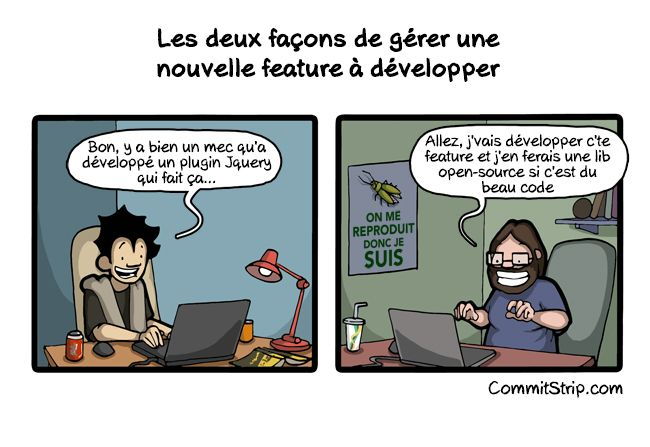

<link rel="stylesheet" href="../styles.css" data-marp-path-resolver="href" />

# Introduction au javascript

## Javascript dans le navigateur

Thibault Clérice,
École Nationale des Chartes
https://github.com/ponteineptique/cours-javascript

---

# DOM

- Pour *Document Object Model*
- Pense la page web comme un document fait de noeuds 


- Standardisé par le W3C afin de favoriser son exploitation 

---

# Le DOM en javascript

## Sélectionner

La sélection d'élément du DOM en javascript utilise les mêmes sélecteurs que CSS

- `document.getElementById('test-table')` sélectionnera `#test-table`
- `document.getElementsByTagName("span")` sélectionnera les `span`
- `document.getElementsByClassName("classes")` sélectionnera les `.classes`
	- On peut faire des sélections encore plus fines :  `document.getElementsByClassName("classes secondeclasses")` sélectionnera `.classes.secondeclasses`

- `.getElementById()` ne renvoie qu'un résultat contrairement au reste (car un ID doit être unique). On peut continuer à construire notre requête sur cet élément :
	- `document.getElementById('main').getElementsByClassName('test')` sélectionnera les éléments `#main .test`
- On peut aussi utiliser `document.querySelector('#foo > div.bar')` qui prend comme l'exemple l'indique un sélecteur CSS

---

# Le DOM en Javascript

## Modifier

- On peut changer les CSS via `monElement.style.nomDePropriété = valeur;` 
```js
var div = document.getElementById('#ma_div');
div.style.backgroundColor = "red";
```
- On peut changer le contenu html via `innerHTML`
```js
var div = document.getElementById('#ma_div');
div.innerHTML = `<a href="#">
Ajouter un lien
</a>`; // On utilise ` pour faire des chaînes multilignes;
```
- On peut changer le contenu textuel via `.innerText`:
```js
div.innerText = "Bonjour le monde !";
```
- On peut utiliser ces propriétés pour récupérer les valeurs aussi

---

# Exercice 1

- Changer le texte "Titre 2" en `"Un Joli Titre"`
- Mettre l'article 2 avec une marge de `150px`
- Remplacer l'intégralité du HTML avec un article 3
```html
<html>
 <body>
   <article id="article_1">
     <header class="sub-info">Titre</header>
     <section>Lorem Ipsum</section>
     <footer class="sub-info">Auteur</footer>
   </article>
   <article id="article_2">
     <header class="sub-info">Titre 2</header>
     <section>Lorem Ipsum 2</section>
     <footer class="sub-info">Auteur 2</footer>
   </article>
   <script type="text/javascript">
   // Votre code ici
   </script>
 </body>
</html>
```
---

# jQuery

## Être développeur-se, c’est être fainéant-e



---

# jQuery

## Petit Historique

- Depuis 2006
- Librairie / Bibliothèque
- Ensemble de fonctionnalités simplifiées
	- Plus grands gains (au moins à l’époque) :
	- Sélecteur CSS avec la fonction $(selecteur)
	- Ajax ( http://api.jquery.com/jquery.ajax/ )
- Cross-browser :
	- Pas de problème (ou moindre) du type Internet Explorer

---

# jQuery

## En général

```html
<html>
 <body>
  <article id="article_1">
    <header class="sub-info">Titre</header>
    <section>Lorem Ipsum</section>
    <footer class="sub-info">Auteur</footer>
  </article>
  <script
     src="https://code.jquery.com/jquery-3.3.1.min.js">
  </script>	
  <script type="text/javascript">
    $(document).ready(function($){
      // Votre code ici !
    });
  </script>
 </body>
</html>
```

---

# jQuery

## Les sélecteurs

jQuery possède son propre système de sélecteurs basé sur les selecteurs CSS comme `document.querySelector()` : il s'agit de `$(selecteur)`.

```js
$("article")  // Récupère l'ensemble des articles

$(".article") // Récupère l'ensemble des éléments 
              //   possédant la classe article
```

Vous retrouverez sur le site de jQuery l'ensemble de ces sélecteurs. On recommandera aussi le site https://oscarotero.com/jquery/ qui a l'avantage de présenter ça agréablement.

---

# jQuery

## Quelques fonctions utiles

```javascript
// Changer la couleur de fond
$("article").css("background-color", "red");
// Cacher un élément
$("article").hide();
// Le faire réapparaître
$("article").hide();
// Changer un attribut
$("article").attr("title", "Mon Titre");
```

Questions : 

- Si j'ai trois articles, que ce passera-t-il ?
- Que recommandez-vous pour éviter cela ?

---

# Javascript

## La notion de *callback*

- Une fonction fournie comme paramètre à un autre fonction
- Généralement, structure de celle-ci préconisée par la documentation (nombre d'arguments, noms, etc.)


```js
// Javascript
var ma_fonction = function(x, mon_callback) {
  return mon_callback(x);
}
```

```python
# Python
def ma_fonction(x, mon_callback):
  return mon_callback(x)
```

---

# Javascript

## Les fonctions anonymes

- Une fonction anonyme est une fonction sans nom. 
- En javascript, cela signifie qu'on ne la stocke pas dans une variable 
- Elles sont généralement utilisées pour les callbacks


```js
// Javascript
ma_fonction(5, function(z) { return z*5; });
```

```python
# Python
ma_fonction(5, lambda z: z*5)
```

---

# Javascript

## Exercice

Complétez le code suivant pour que les résultats soient bons :

```js
var ma_fonction = function(x, mon_callback) {
  return mon_callback(x);
}

var q1 = ma_fonction(
	7, ___
) === "Blanche Neige et les 7 Nains";

var q2 = ma_fonction(
	9, ___
) === 18;

console.log(q1);
console.log(q2);
```

---

# jQuery

## Les événements

En DOM et donc avec jQuery, les événements sont des actions portées par le document et l'interaction de l'utilisateur avec celui-ci. Par exemple, *"L'utilisateur a cliqué sur ce bouton"* ou *"Le document vient d'être chargé"*.

Les événements propres à des éléments se propagent : si Bouton1 est dans Div1, les deux éléments partagent l'évènement "clique" quand Bouton1 est actionné.

Au contraire, Div1 ne propagera pas l'évènement si le clic est fait en dehors de Bouton1 mais bien à l'intérieur de Div1.

Ces évènements sont à la source de toutes les intéractions en javascript: quand utilisateur clique sur X alors faire Y.

---

# jQuery

## Les événements

En jQuery, ces évènements ont liés aux éléments via `.on()` qui prend en premier les évènements sur lesquels réagir, et en deuxième une fonction *callback* qui prendra comme premier paramètre l'évènement :

```js
$(".btn").on("click", function (event) {
  // On annule l'action par défaut du bouton
  event.preventDefault();
  // ...
```

Dans cette fonction, on utilisera `$(this)` pour référer à l'élément courant qui porte l'évènement :


```js
  $(this).addClass("btn-success");
});
```

---

# jQuery

## Créer du HTML

On peut ajouter des nouveaux éléments HTML via `.append(objet)` et `.prepend()` (l'un en suffixe, l'autre en préfixe).

Pour créer des éléments, on pourra utiliser `$()` avec une chaîne HTML à la place d'un sélécteur.

```js
var input_form = $('<div class="form-control"></div>'),
input_nom = $('<input type="text" name="nom[]" />'),
input_lang = $('<input type="text" name="lang[]" />');

input_form.append(input_nom);
input_form.append(input_lang);
$("body").append(input_form);
```

https://jsfiddle.net/ponteineptique/3wsxdnr6/1/ et https://jsfiddle.net/ponteineptique/3wsxdnr6/5/

---

# jQuery

## Ajouter du HTML

On peut bien sûr écrire des éléments avec sous éléments en un seul morceau :

```js
var html = `<div class="form-control">
<input type="text" name="nom[]" />
<input type="text" name="lang[]" />
</div>`
$("body").append($(html));
```

https://jsfiddle.net/ponteineptique/6pu9omty/

---

# jQuery

## Générer des champs de formulaire à la demande

- Exercice en groupe ou hors classe suivant l'avancée du cours