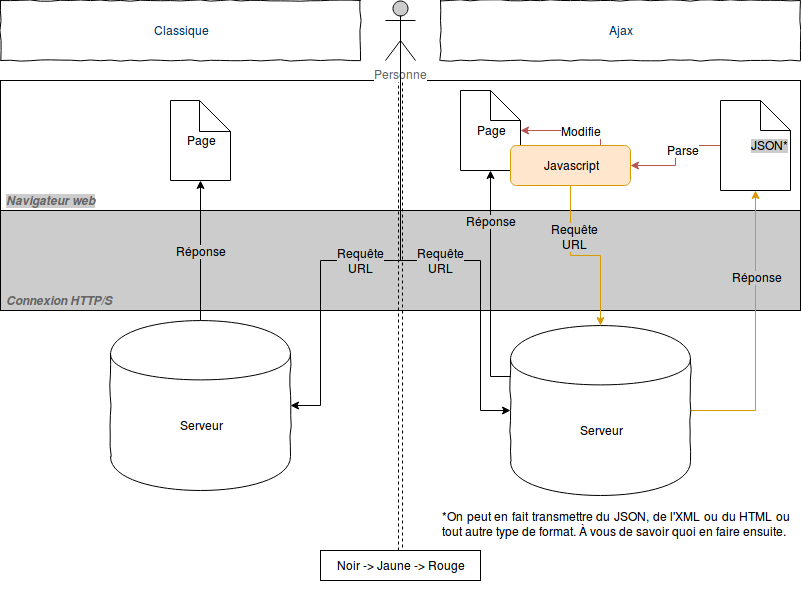
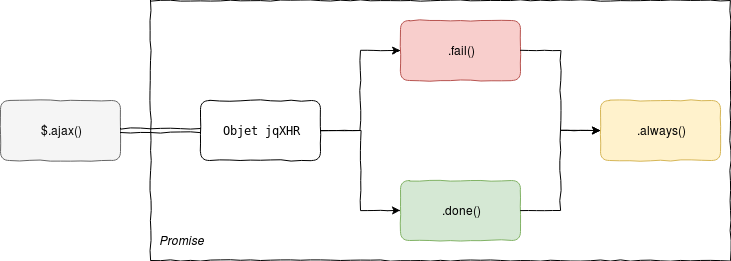

<link rel="stylesheet" href="../styles.css" data-marp-path-resolver="href" />

# Introduction au javascript

## Les données après le chargement : AJAX et son utilisation

Thibault Clérice,
École Nationale des Chartes
https://github.com/ponteineptique/cours-javascript

---

# Ajax

- *Asynchronous Javascript And Xml*
- Requête / Code asynchrone : code dont l'exécution n'est pas bloquante pour le reste de la page.

```Javascript
// Pseudocode bien sûr
var x = 1;
asynchrone("20 secondes puis afficher 2");
console.log(x);
```
> Console.log affichera `1` d'abord, puis affichera `2` 20 secondes environ plus tard.

- Permet de récupérer des données une fois la page affichée
- Contrairement à ce que son nom indique, permet de récupérer tout type de contenu.
- Peut aussi être utiliser pour envoyer des données sans en récupérer en retour.

---

# Ajax (2)



---

# Ajax : les promesses

```javascript
var jqxhr = $.ajax("http://google.fr")
  .done(function() {
    alert( "success" );
  })
  .fail(function() {
    alert( "error" );
  })
  .always(function() {
    alert( "complete" );
  });
```



---

# Ajax (4) : exercice en groupe

---

# Exercice à la maison

- Utilisez le même serveur dans le dossier `./cours-3/serveur`
```sh
python -m SimpleHTTPServer
```
- Éditez exercice.html afin qu'il soit possible de requêter /api/latinLit.json et de trier les textes en fonction des objets json
- Testez sur http://localhost:8000/
